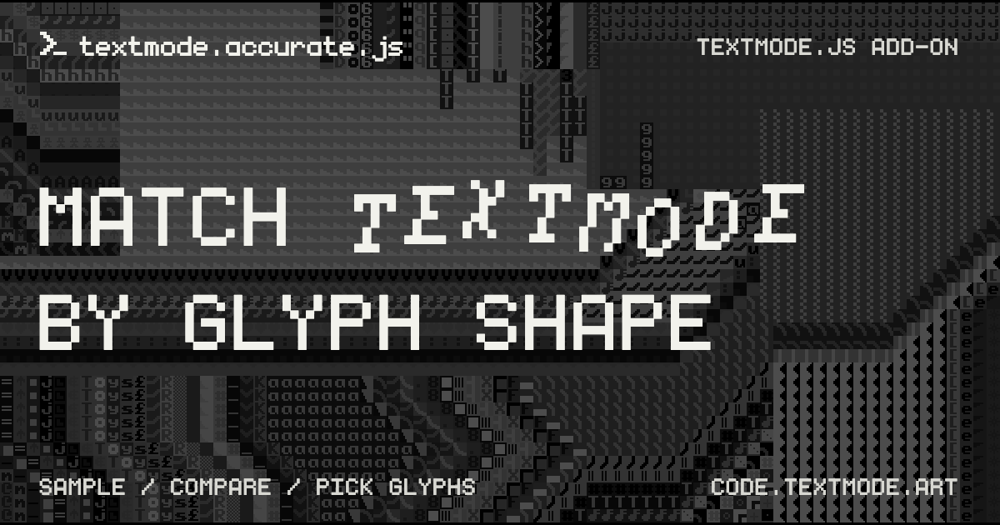

# textmode.accurate.js

|    |    |   |
|:---|:---|:---|

`textmode.accurate.js` is an accurate media conversion add-on for [`textmode.js`](https://github.com/humanbydefinition/textmode.js) that restores higher-fidelity glyph matching for image, video, and texture sources. It registers a new `accurate` conversion strategy next to the built-in `brightness` mode, so sources choose glyphs from sampled cell shape instead of average luminance alone.

The built-in `brightness` mode picks glyphs from average luminance. The `accurate` mode samples each cell in a grid, compares candidate glyph masks against the source-cell silhouette, and keeps the closest match — at the cost of more computation per frame.

## Features

- **Accurate conversion mode** - Register an `accurate` strategy next to the built-in `brightness` mode through the standard `textmode.js` plugin system
- **Glyph-shape matching** - Sample each cell and compare candidate glyph masks against the source-cell silhouette instead of average luminance
- **Sampled color pipeline** - Preserve sampled foreground and background color behavior from the core conversion pipeline
- **ESM and UMD** - One `AccurateConversionPlugin` export for both bundler and browser consumers
- **`image()` integration** - Use `conversionMode('accurate')` on image, video, and texture sources rendered with `image()`

> [!NOTE]
> The `accurate` conversion mode is more computationally expensive than the default `brightness` mode. It may not be suitable for all use cases, especially on lower-end devices.

## Try it online first

Open [editor.textmode.art](https://editor.textmode.art/), a browser-based live-coding environment for the
complete official `textmode.js` ecosystem. Sketches run as you edit, with no local toolchain required.

The editor includes `textmode.js` and all four official add-ons: `textmode.export.js`, `textmode.filters.js`,
`textmode.figlet.js`, and `textmode.synth.js`.

- Write with Monaco-powered completions, hover documentation, and diagnostics.
- Start with a blank sketch, an included example, or a community gallery sketch.
- Keep code and preferences saved in the browser, then share sketches through URL-based links.
- Use microphone or line-input analysis for audio-reactive work, and create on desktop or mobile.

Use it to experiment with accurate conversion while your sketch runs.

## Installation

Follow the [official installation guide](https://code.textmode.art/docs/installation) to install
`textmode.accurate.js` alongside `textmode.js` with npm or browser-ready UMD bundles.

## Next steps

- **[Read the documentation](https://code.textmode.art/)** for core concepts and plugin workflows.
- **[Browse the API reference](https://code.textmode.art/api/textmode.accurate.js/)** for the complete accurate conversion API.
- **[Explore the examples](./examples/)** to see plugin setup and conversion mode patterns in action.
- **[Try the live editor](https://editor.textmode.art/)** to experiment with accurate conversion in the browser.

## Contributing

Thank you for considering contributing to this project! (✿◠‿◠)

Please read the [Contributing Guide](./CONTRIBUTING.md) to get started.

<!-- TEXTMODE-CONTRIBUTORS:START -->
<!-- prettier-ignore-start -->
<!-- Generated from https://github.com/humanbydefinition/code.textmode.art/blob/main/.vitepress/data/contributors.json and https://github.com/humanbydefinition/code.textmode.art/blob/main/.vitepress/data/contribution-types.json. Do not edit this section directly. -->
## Contributors

Thanks to the people who contribute code, documentation, design, examples, ideas, infrastructure, and care
across the textmode.js ecosystem.

<!-- markdownlint-disable MD033 -->
<table>
  <tbody>
    <tr>
      <td align="center" valign="top" width="14.28%">
        <a href="https://github.com/humanbydefinition">
          
           <b>humanbydefinition</b>
        </a>
         💻 📖 🎨 💡 🤔 🚧 🚇 🔧 🔌 👀
      </td>
      <td align="center" valign="top" width="14.28%">
        <a href="https://github.com/trintlermint">
          
           <b>trintlermint</b>
        </a>
         🎨 💡
      </td>
    </tr>
  </tbody>
</table>
<!-- markdownlint-enable MD033 -->

Contribution details and profile links are maintained on the [textmode.js contributors page](https://code.textmode.art/docs/contributors).
<!-- prettier-ignore-end -->
<!-- TEXTMODE-CONTRIBUTORS:END -->

## License

`textmode.accurate.js` is licensed under the [MIT License](./LICENSE).
